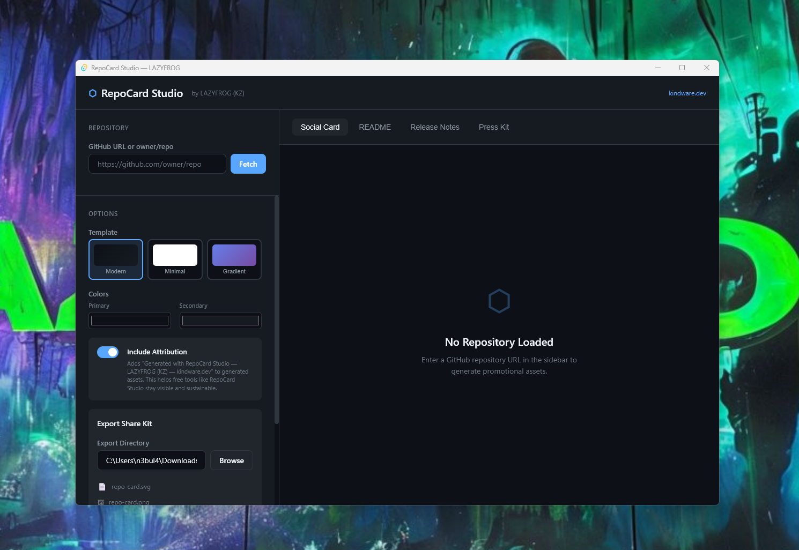
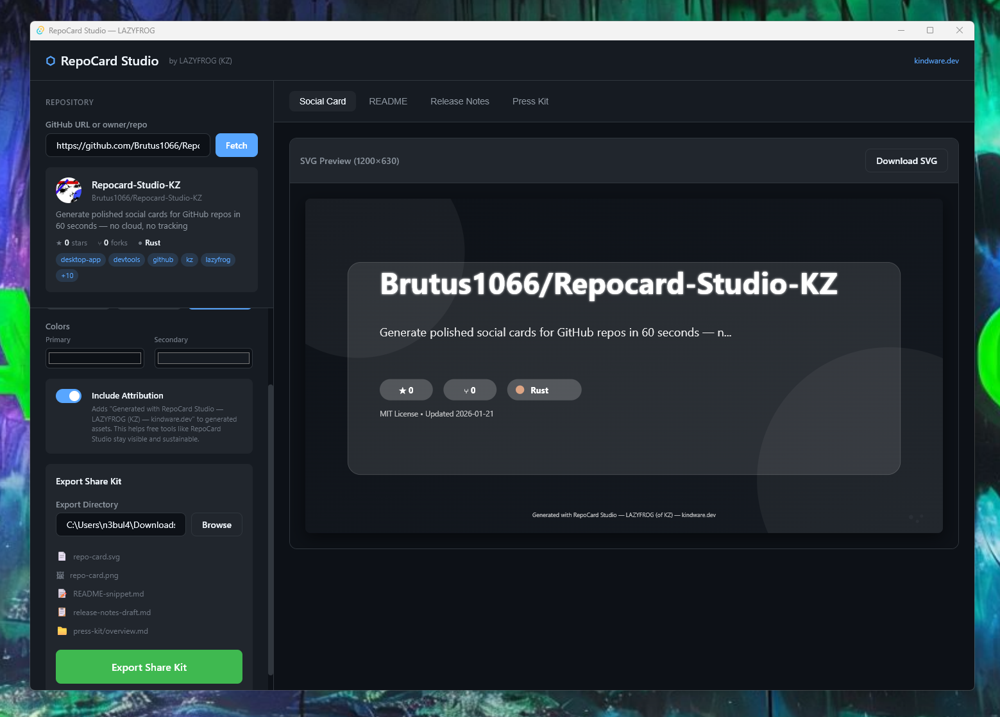
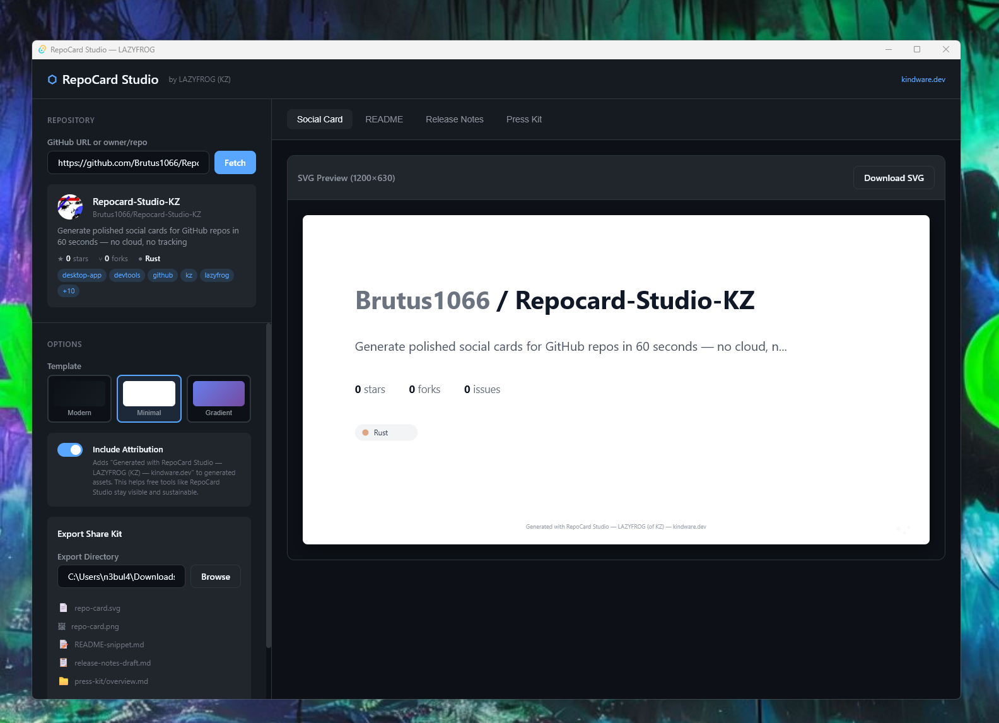

# RepoCard Studio KZ v1.0.0 — LAZYFROG / KZ

**Generate polished social cards, README snippets, and press kits for your GitHub repos — in 60 seconds.**

---

## ✨ Key Features

- **3 Beautiful Templates** — Modern (dark), Minimal (light), Gradient (customizable)
- **Social Card Export** — SVG + PNG at optimal 1200×630 resolution
- **README Snippets** — Copy-paste markdown sections
- **Release Notes Draft** — Auto-generated from recent commits
- **Press Kit Generator** — Complete promotional folder with all assets

---

## 🔒 Trust Statement

RepoCard Studio is a **local-first desktop app** with zero cloud dependencies:

| Promise | Status |
|---------|--------|
| No telemetry | ✅ |
| No analytics | ✅ |
| No account required | ✅ |
| No data leaves your machine | ✅ |
| Works offline (after initial fetch) | ✅ |

Your repos, your files, your control.

---

## 📦 Assets

| File | Description |
|------|-------------|
| `RepoCard-Studio-KZ-1.0.0-Setup.exe` | Windows NSIS Installer |
| `RepoCard-Studio-KZ-1.0.0-x64.msi` | Windows MSI Installer |
| `RepoCard-Studio-KZ-1.0.0-SHA256SUMS.txt` | SHA256 checksums for verification |

---

## 🛠️ Requirements

- Windows 10/11 (64-bit)
- WebView2 Runtime (included in Windows 11, auto-installs on Windows 10)

---

## 📸 Screenshots

---

## 🙏 Credits

Built by **LAZYFROG (creator of KZ)** — [kindware.dev](https://kindware.dev)

MIT License
